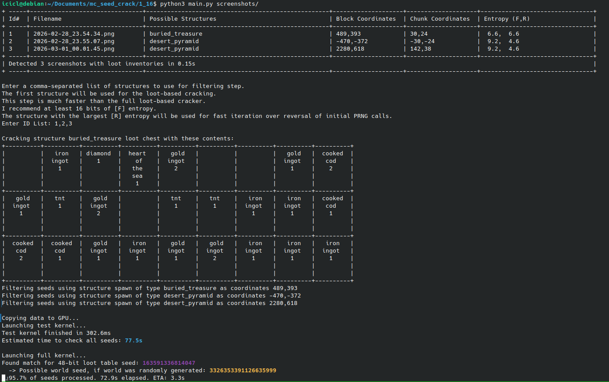
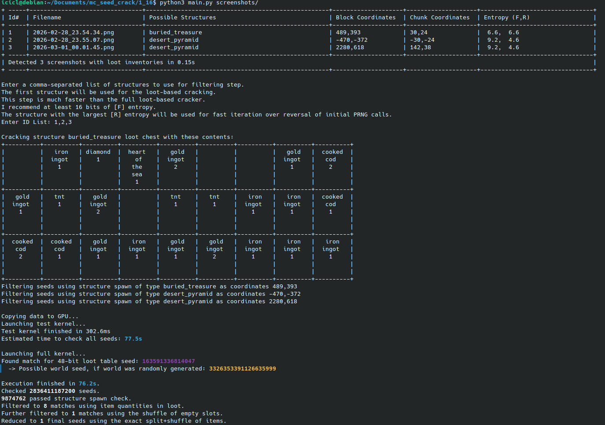

# GPU-Accelerated Minecraft Seed Cracker

A GPU-accelerated utility for Minecraft seed-cracking. This project brute forces the Java Random PRNG LCG to find the seed that produces a given structure chest in the following process:
1. Structure generates at current coordinates.
2. The total number of each loot item in the chest matches.
3. The exact slot locations and stack sizes in the chest match. 

It uses python to extract the necessary information automatically from a screenshot.

## Requirements
NVidia GPU with `nvcc` and `python3` installed.
## How to use
  1. Compile to a shared object, allowing python to directly call the CUDA methods. This only needs to be done once.
  Either use the included Makefile, or manually compile (run either of the following).
```
make
```
```
nvcc -O3 -Xcompiler -fPIC -shared crack3.cu -o crack.so
```
  2. Open a chest in a Minecraft structure with your F3 screen on, and take a screenshot. Using multiple different structures will speed up the cracking.
  3. Run with Python3. Either look for screenshots in Minecraft's default directory or manually specify a path (to a directory containing one or more)
```
python3 main.py                        # default directory
```
```
python3 main.py /path/to/screenshots/  # manually specify
```

  4. The first time you run the software, it will take a minute or two to process the Minecraft .jar and create necessary files. This will only need to run once.
  5. If the automated OCR of loot contents fails, each run prints the OCR results to a file in `./run_history/`. You can correct the loot data, and rerun on the edited `.txt` file:
  ```
  python3 ./run_history/filename.txt
  ```

## Mechanics

- **Automatic Image Processing**:
  - Extracts the targeted block coordinates of the open chest from the F3 screen.
  - Scans the 27 chest slots, comparing each slot to all possible items, and using OCR for the item count.
  - Based on the loot items, determine which structure the chest belongs to.
- **CUDA Seed Cracking Kernel**: Highly optimized C++/CUDA kernel (`crack3.cu`) leveraging shared memory, custom LCG PRNG step inversion, and multi-stage hardware filtering:
  1. **Structure Spawn Location**: Fast check if the specified structure(s) can spawn at the coordinates needed.
     - Some structure types also enable reversing the first PRNG call to reduce the number of seeds by a few orders of magnitude.
     - This is the fastest check, so providing more than one structure will speed up the cracking.
  2. **Loot Table Items**: Simulate the items and quantities generated by a chest at that location (including multiple PRNG calls for enchanted items).
  3. **Empty Slot Shuffle**: Use the initial shuffle of items to rule out seeds where an empty slot in the screenshot would be occupied.
  4. **Exact item Shuffle**: Verify the exact slots and stack sizes of all items after all shuffling and splitting.
  5. **Initial LCG PRNG Reversal**: the structures and loot are determined by only the lower 48 bits of a 64 bit seed. If a seed was not manually specified, the world seed is produced by a call to Java.Random.nextLong(), so it is easy to check all 2^16 possible full seeds for being a possible output of this call.

## Usage Demo Screenshots
<details>
<summary><b>Seedcracker while running:</b> shows found seeds, progress, time elapsed, and ETA</summary>


</details>
<details>
<summary><b>Seedcracker once completed:</b> shows found seeds, time taken, and info on number of seeds checked</summary>


</details>